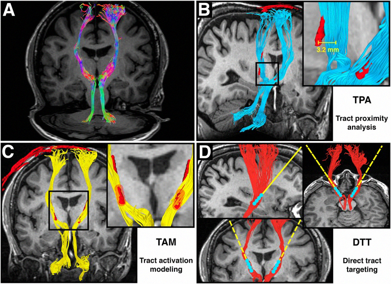

# DBSI Automated Tractography

Diffusion Basis Spectrum Imaging is an MRI modality that generates contrast by using the differential diffusion of water. The random movement of water in-vivo is constrained by tissue characteristics (among other factors) and thus can be used to distinguish between adjacent equi-dense structures.

Specifically, DBSI has been used to identify white matter tracts in MRI datasets of the brain and spinal cord. Clinically this technique is important for monitoring changes in the setting of traumatic injury or neurodegenerative processes.  Tractography, the annotation of the white matter axons, is often performed by hand or through simple threshold-based approaches.

This project attempts to automate a portion of tractography. A user marks the beginning of a potential axonal tract, and the algorithm extends it using logistic regression.

Special thanks to braintools, an MRI annotation toolbox upon which we relied heavily in the development of our toolset.

Sun, P., Murphy, R. K., Gamble, P., George, A., Song, S. K., & Ray, W. Z. (2017). Diffusion assessment of cortical changes, induced by traumatic spinal cord injury. Brain Sciences, 7(2), 21.

